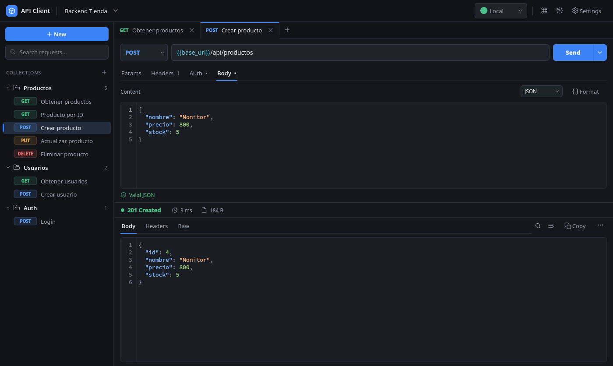
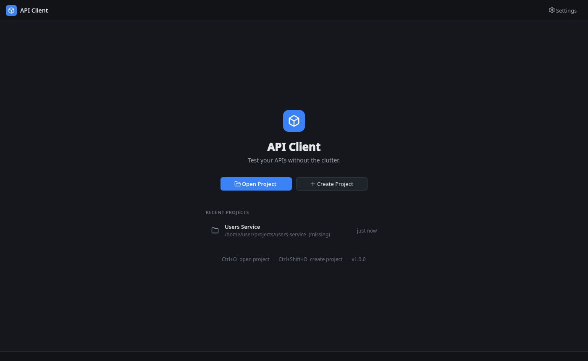
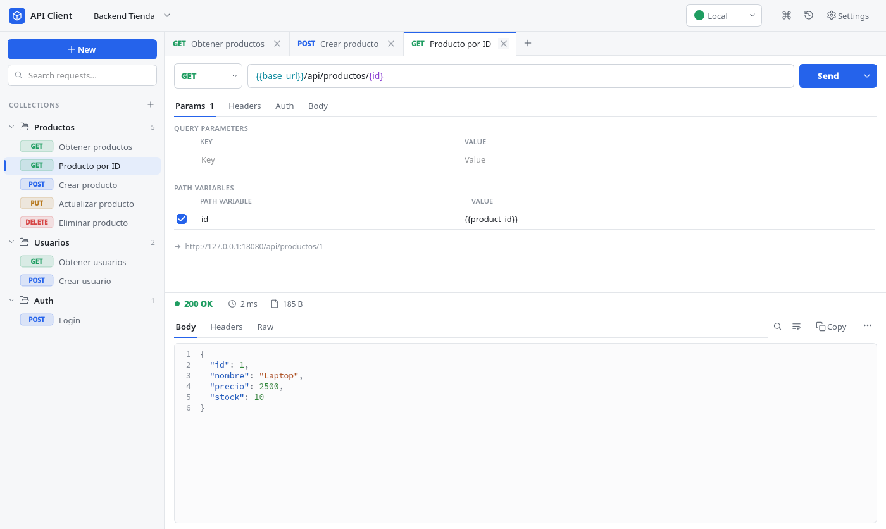

# API Client

A lightweight, fast desktop REST client for backend developers, focused on Spring Boot projects.
Think Postman or Thunder Client with only the features you use every day, and with your requests
stored **inside your repository** so the whole team shares them through Git.



## Features

- **Projects bound to your backend repo.** Everything lives in `<your-backend>/api-client/` as readable JSON.
- **Collections and requests.** Create, rename, duplicate, move and delete them from the sidebar or context menus.
- **All HTTP methods:** GET, POST, PUT, PATCH, DELETE, HEAD, OPTIONS.
- **Query params and path variables** (`/api/productos/{id}`), both in editable tables. The final URL is previewed live.
- **Headers** with autocomplete for common names and values.
- **Auth:** None, Bearer Token and Basic Auth. The design allows adding OAuth2 later.
- **JSON body editor** with syntax highlighting, line numbers, auto-indent, Format (Ctrl+Shift+F) and inline validation
  (`Invalid JSON — line 5`) that also marks the bad line. `{{variables}}` inside JSON are supported.
- **Environments and variables:** `{{base_url}}`, `{{token}}`… with per-environment values. Undefined variables are
  underlined in red in the URL, and hovering one shows its value.
- **Secrets** in a git-ignored `.secrets.json`, masked in logs, history and cURL exports.
- **Response viewer:** colored status, time and size, pretty-printed JSON, headers, raw view, find (Ctrl+F),
  word wrap, copy and save to file.
- **Non-blocking requests** on a thread pool. **Send** turns into **Cancel** while a request is running.
- **Autosave** with a 700 ms debounce. There is no Ctrl+S habit to keep.
- **Tabs** for open requests. They are restored, along with the environment, splitter sizes and collapsed
  collections, when you reopen the project.
- **History** of sent requests (SQLite) that you can filter and clear.
- **Command palette** (Ctrl+K) to jump to any request or action.
- **Copy as cURL**, which warns you and masks secrets when the request carries credentials.
- **Dark theme** by default, plus Light and System.
- **Readable errors** for connection refused, timeouts, DNS, SSL, invalid URLs, missing variables and corrupt
  files. A broken JSON file is skipped and **never overwritten**.

## Requirements

- Python **3.12+**
- Linux, Windows or macOS with a desktop session

Dependencies: `PySide6` (UI) and `httpx` (HTTP). Nothing else at runtime.

## Quick install (Linux)

```bash
git clone https://github.com/ezerutp/api-client.git
cd api-client
./install.sh
```

The script:

1. Runs `git pull` to get the latest version. It skips the pull if you have local changes.
2. Finds Python 3.12+ and creates or updates `.venv` with the dependencies.
3. Installs the `api-client` command in `~/.local/bin`, the icon, and an **API Client** entry in your
   applications menu.

Run `./install.sh` again at any time to update. `./install.sh --uninstall` removes the launcher; your
projects and settings are kept. The script never uses sudo or writes outside your home folder.

## Manual installation and running

### Linux / macOS

```bash
python -m venv .venv
source .venv/bin/activate
pip install -r requirements.txt
python main.py
```

### Windows

```bat
python -m venv .venv
.venv\Scripts\activate
pip install -r requirements.txt
python main.py
```

You can also pass a backend folder to open it directly:

```bash
python main.py ~/projects/backend-tienda
```

### Try it without a Spring Boot app

The repository includes an example project and a tiny mock backend (standard library only):

```bash
python tools/mock_server.py            # http://localhost:8080
python main.py examples/backend-tienda # in another terminal
```

Open **Productos › Crear producto**, press **Ctrl+Enter**, and you get `201 Created` with the new product.

## How `api-client/` works

When you open a backend folder, the app looks for `api-client/project.json` inside it. If the file doesn't
exist, it offers to create it.

```
backend-tienda/
├── src/
├── pom.xml
└── api-client/
    ├── project.json      ← name, base URL, environments, variables (committed)
    ├── productos.json    ← one file per collection (committed)
    ├── usuarios.json
    ├── auth.json
    ├── .secrets.json     ← tokens, passwords (NOT committed)
    └── .gitignore        ← contains ".secrets.json"
```

**project.json**

```json
{
  "schema_version": 1,
  "name": "Backend Tienda",
  "base_url": "http://localhost:8080",
  "active_environment": "local",
  "variables": { "product_id": "1" },
  "environments": {
    "local":       { "base_url": "http://localhost:8080" },
    "development": { "base_url": "https://dev.api.midominio.com" },
    "production":  { "base_url": "https://api.midominio.com" }
  },
  "collections": ["productos", "usuarios", "auth"]
}
```

`active_environment` is only the default for someone opening the project for the first time. The environment
you pick is remembered on your machine, so switching environments never changes a committed file.

**A collection file** (`productos.json`)

```json
{
  "id": "productos",
  "name": "Productos",
  "base_path": "/api/productos",
  "requests": [
    {
      "id": "create-product",
      "name": "Crear producto",
      "method": "POST",
      "url": "{{base_url}}/api/productos",
      "params": [],
      "path_params": [],
      "headers": [{ "enabled": true, "key": "Accept", "value": "application/json" }],
      "auth": { "type": "bearer", "token": "{{token}}" },
      "body": { "type": "json", "content": "{\n  \"nombre\": \"Monitor\",\n  \"precio\": 800\n}" },
      "created_at": "2026-09-25T10:00:00Z",
      "updated_at": "2026-09-25T10:00:00Z"
    }
  ]
}
```

`base_path` mirrors the controller's `@RequestMapping`. New requests in the collection start with
`{{base_url}}` followed by that path. Files are written atomically (temp file, then rename), with 2-space
indentation, so diffs stay small and reviewable.

### Variables

Write `{{name}}` anywhere: URL, params, path variable values, headers, auth fields or body. The app resolves
them just before sending. Sources, where later ones win:

1. `base_url` from `project.json`
2. Global variables (`variables` in `project.json`)
3. Global secrets (`.secrets.json`)
4. Variables of the active environment
5. Secrets of the active environment

Variables may reference other variables. Circular references and undefined variables are reported clearly
before any request is sent. Substitution is plain text replacement: nothing is ever evaluated.

### Secrets

Keep tokens, passwords and API keys in `.secrets.json`:

```json
{
  "api_key": "global secret, available in every environment",
  "local":      { "token": "abc123" },
  "production": { "token": "xyz789", "password": "..." }
}
```

You can also manage them from **Environments**: click the lock icon next to a variable to store its value in
`.secrets.json` instead of `project.json`. The file is listed in `api-client/.gitignore`, which is created
automatically. Secret values are masked in log files, history entries, the URL preview and cURL exports
(unless you explicitly choose to include them).

## Keyboard shortcuts

| Shortcut | Action |
|---|---|
| Ctrl+Enter | Send the request (works from any field) |
| Ctrl+N | New request |
| Ctrl+Shift+N | New collection |
| Ctrl+L | Select the URL |
| Ctrl+W | Close the tab (the request is kept) |
| Ctrl+Shift+F | Format the JSON body |
| Ctrl+K / Ctrl+Shift+P | Command palette |
| Ctrl+E | Switch environment |
| Ctrl+P | Search the sidebar |
| Ctrl+F | Find in the response |
| Ctrl+D | Duplicate the request |
| Ctrl+S | Save now (autosave already does it) |
| Ctrl+H | History |
| Ctrl+Tab / Ctrl+Shift+Tab | Next / previous tab |
| Ctrl+O / Ctrl+Shift+O | Open / create a project |
| Ctrl+, | Settings |
| F2 / Delete (sidebar) | Rename / delete the selected item |

## Project structure

```
api_client/
├── main.py                      entry point
├── app/
│   ├── bootstrap.py             QApplication, logging, database, theme
│   ├── models/                  dataclasses: Project, Environment, Collection, ApiRequest,
│   │                            RequestHeader/Parameter/PathParameter, Authentication, ApiResponse,
│   │                            HistoryEntry, AppSettings
│   ├── storage/                 atomic JSON files, SQLite (with migrations), user data paths
│   ├── repositories/            project, collections, secrets, settings, recent projects, history, UI state
│   ├── services/
│   │   ├── variable_service.py  {{variable}} resolution and precedence
│   │   ├── request_builder.py   URL, path/query params, headers, auth, body → PreparedRequest
│   │   ├── http_client_service.py  httpx execution, timing, size, cancellation
│   │   ├── auth_strategies.py   one strategy per auth type (extension point for OAuth2)
│   │   ├── project_service.py   operations on an open api-client/ folder
│   │   ├── json_service.py      validation/formatting that tolerates {{variables}}
│   │   └── curl_service.py      "Copy as cURL"
│   ├── network/                 QRunnable worker, exception → readable error mapping
│   ├── importers/               interfaces for future importers/exporters
│   ├── themes/                  palettes (theme.py), QSS template (style.qss), theme manager
│   ├── utils/                   logging with secret redaction, formatting, slugs
│   └── ui/
│       ├── main_window.py       wires widgets and services together
│       ├── widgets/             sidebar, tabs, request editor, URL field, code editor, key/value
│       │                        tables, auth/body editors, response viewer, home screen, toasts
│       └── dialogs/             create project, new request, collections, environments, settings,
│                                history, command palette, confirmations
├── tests/                       pytest suite (core logic and an end-to-end UI smoke test)
├── tools/mock_server.py         in-memory backend for trying the app
└── examples/backend-tienda/     sample api-client/ folder
```

Layering rules: `models` have no dependencies. `services` and `repositories` don't import Qt. Widgets never
read or write files; they emit signals that `MainWindow` turns into `ProjectService` calls.

App-wide data (recent projects, settings, history, window and tab state) lives in a SQLite database in your
user data folder: `~/.local/share/api-client/` on Linux, `%APPDATA%\api-client\` on Windows. It is never
stored inside a repository. Set `API_CLIENT_DATA_DIR` to use another location.

## Tests

```bash
pip install -r requirements-dev.txt
pytest
```

The suite covers variable resolution, URL building, query and path params, auth, JSON body handling, cURL
masking, collection read/write, corrupt files, secrets separation, real HTTP calls against a local server,
and an end-to-end flow through the main window: create a project, send a request, autosave, restart and
check that everything is restored.

## Building an executable

The code is ready for PyInstaller (resources are resolved through `sys._MEIPASS`):

```bash
pip install -r requirements-dev.txt
pyinstaller api_client.spec
# → dist/api-client/api-client   (Windows: dist\api-client\api-client.exe)
```

## Roadmap

The architecture already has extension points for:

- **Import endpoints from Spring Boot:** scan `@RestController`, `@RequestMapping`, `@GetMapping`,
  `@PostMapping`… and generate collections (`app/importers/base.py`, `CollectionImporter`).
- Postman / OpenAPI import and collection export (`CollectionImporter` / `CollectionExporter`).
- OAuth2 and API-key auth (`app/services/auth_strategies.py`, `register_strategy`).
- Proxy and client certificates (`NetworkSettings`).

## Screenshots

| Home | Light theme |
|---|---|
|  |  |
